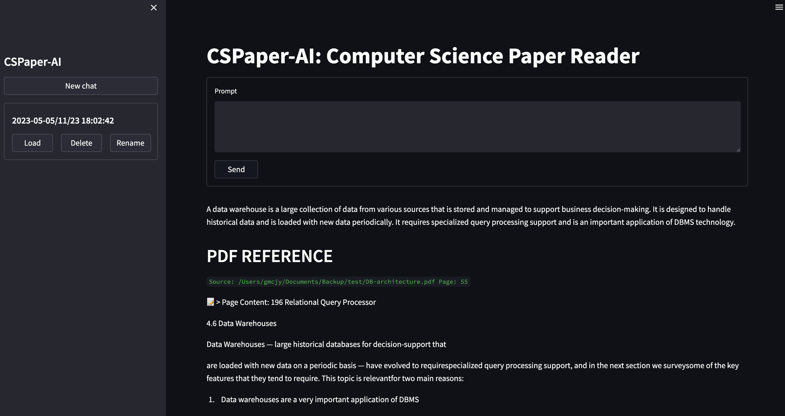

# CSPaper-AI : Computer Science Paper Reader

### The purpose of this Learning Tool is to serve as an AI for Computer Science Papers, capable of referencing and extracting additional information from OpenAI. The tool displays references to papers and the corresponding response from OpenAI.





## Core Features

* Custom Agent
* Qdrant Vector DB for Storing PDFs
* Custom Tools
* Qdrant Document Loader Agent (_inprogress_)
* An Integrated Simple Streamlit UI, it has basic memory

> This tool is highly inspired by [llm_agents](https://github.com/mpaepper/llm_agents), [Virat's work](https://twitter.com/virattt) & [ChattierGPT-UI](https://github.com/thderoo/ChattierGPT-UI) 

## 💾 Installation

1. Navigate to the directory where the repository was downloaded

    ```bash
    cd cspaper-ai
    ```
2. Install the required dependencies

    ```bash
    pip install -r requirements.txt
    ```

3. Configure OpenAI Key
    * If Using OpenAI key, simply `export OPENAI_API_KEY=*****`
    * If want to use config file, rename `config_template.ini` -> `config.ini` file inside the `database_agent` dir & update either Azure or OpenAI config

    By completing these steps, you have properly configured the API Keys for your project.


## 🔧 Usage

### Upload Data in Qdrant Vector Database
 
 1. Copy all desired PDFs in a directory
 2. Update the directory path in `./config.py` >> `pdf_uploadpath`
 3. Run the command

 ```python
    python -m paperai upload
```
 
__Its a 1 time job and once, the pdfs are loaded then user can ignore this step for next runs__


### Run the Tool

```python
python -m paperai run
```

## Known Issues
1. The Qdrant Vector Database is currently not operating in server mode, therefore document uploads are only permitted once. If new PDFs are to be added, it is necessary to delete the collection using `client.delete_collection(collection_name="test_papers")` and then re-upload the documents.

